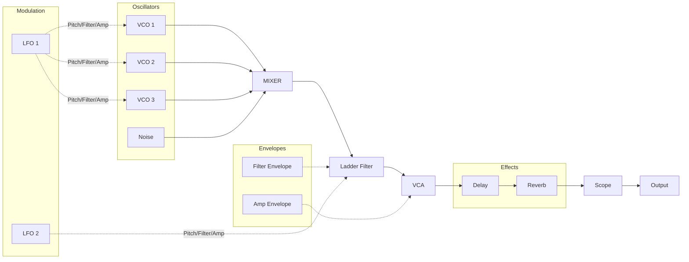

# Moog Modular Synthesizer

A web-based Moog-style modular synthesizer built with the Web Audio API.


## About

This project is a nostalgic journey back to the 80s. Remember when our Amstrad CPC464 felt like a portal to infinite possibilities? That feeling of wonder while exploring technology hasn't faded.

Built entirely with vanilla JavaScript and the Web Audio API, this synthesizer recreates the classic Moog modular architecture - no frameworks, no dependencies, just pure audio synthesis in the browser.

This is a "vibe coding" project, developed in collaboration with Claude Code, demonstrating how AI can assist in creative programming while maintaining the joy of building something from scratch.

**Read the full story:** [Web Audio API: Building a Moog-Style Modular Synthesizer in JavaScript](https://a80.it/blog/web-audio-api-building-a-moog-style-modular-synthesizer-in-javascript)

## Architecture



## Features

- **3 VCOs** with sawtooth, square, triangle, and sine waveforms
- **Classic Moog ladder filter** with resonance and keyboard tracking
- **Dual ADSR envelopes** for filter and amplitude
- **2 LFOs** with multiple modulation destinations
- **Effects**: delay and reverb
- **Real-time oscilloscope** visualization
- **Preset system** with classic synth sounds
- **Demo songs** including Daft Punk, Chase, and more
- **Recording** with export to WebM
- **User presets** saved to local storage
- **Playable keyboard** via mouse or computer keys

## Getting Started

Simply serve the project with any static HTTP server:

```bash
python3 -m http.server 8000
# or
npx serve .
```

Then open `http://localhost:8000` in your browser.

## License

Made with ❤️ by [Mircha Emanuel D'Angelo](https://a80.it)

CC BY-SA 4.0
